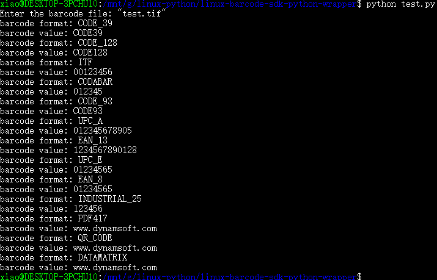

# Linux Barcode SDK Wrapper for Python
Build the **Python** extension with Dynamsoft Barcode Reader SDK for Linux. 

## Environment
* Python 2.7/3.x
* Ubuntu 16.0
* [Dynamsoft Barcode SDK 6.2](https://www.dynamsoft.com/Downloads/Dynamic-Barcode-Reader-for-Linux-Download.aspx).

## How to Build the Extension 
1. Create a symlink for libDynamsoftBarcodeReaderx64.so:

    ```
    sudo ln -s <Your PATH>/libDynamsoftBarcodeReaderx64.so /usr/lib/libDynamsoftBarcodeReader.so
    ```

2. Install **Numpy**:

    ```
    pip install numpy
    ```

3. Build the extension:

    ```
    # Python 2.7
    sudo python setup.py build install
    # Python 3.x
    sudo python3 setup.py build install
    ```

4. Run the test app:

    ```
    # Python 2.7
    python test.py
    # Python 3.x
    python3 test.py
    ```
    

## Blog
[Building Python Barcode Extension with DBR 5.2 for Linux](http://www.codepool.biz/build-linux-python-barcode-extension.html)
